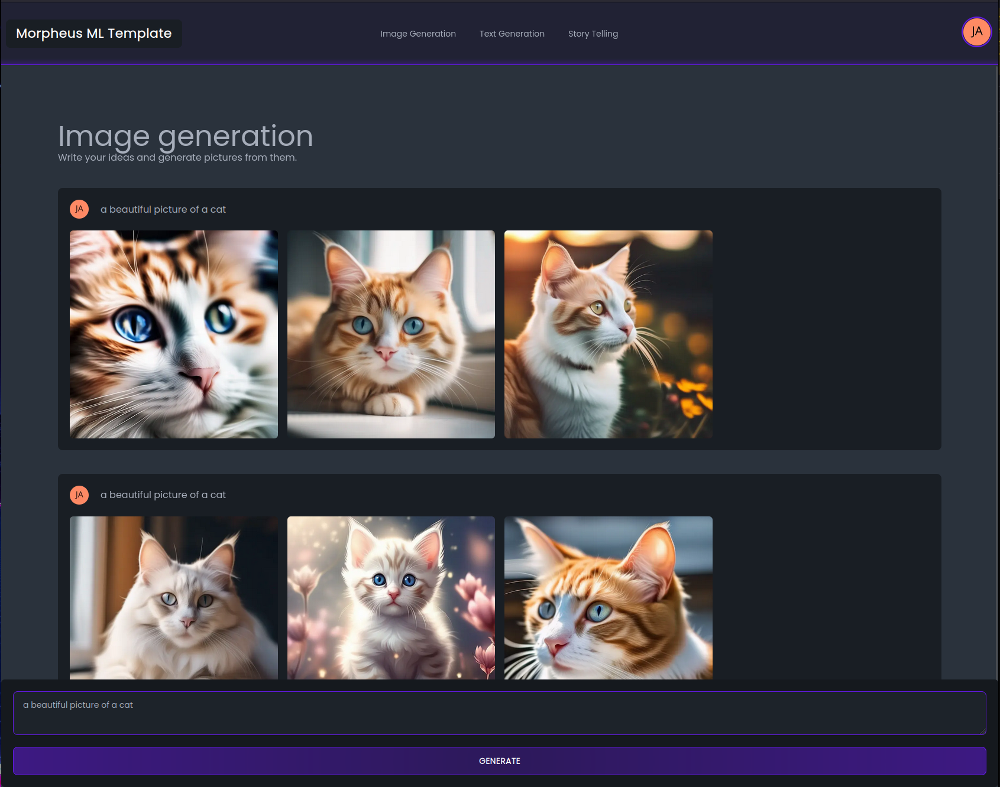

# Morpheus ML Template - Quickstart Guide

Welcome to Morpheus ML Template, a quick start machine learning framework specializing in image and text generation.
This guide will help you quickly set up and run the project.

---

## Prerequisites

Before starting, ensure you have the following prerequisites:

1. **Docker and Docker Compose**: The project is containerized for ease of deployment. Ensure you have Docker and Docker
   Compose installed on your system. Visit [Docker's official website](https://docs.docker.com/get-docker/) for
   installation instructions.

2. **GPU Availability**: This project requires a GPU for optimal performance, particularly for tasks like image
   generation with Stable Diffusion models. Verify that your system has a compatible GPU.

3. **Google Firebase Account**: This template uses Firebase for auth and analytics. Please create a Google Firebase
   account, set up a web application under Firebase, and generate a Python service account. Make sure to enable
   authentication. Visit [Firebase Console](https://console.firebase.google.com/) to get started. You can also follow
   the
   Morpheus [Firebase Integration Guide](https://github.com/Monadical-SAS/Morpheus/blob/main/docs/firebase/firebase.md)

4. **AWS S3 credentials**: This template uses AWS S3 for image storage. Please create an AWS account and generate an access
   key and secret key. Visit [AWS Console](https://console.aws.amazon.com/) to get started.

---

## Configuration

### **Environment Variables**: After setting up Firebase and AWS credentials, replace the necessary values in

the `server`, `client`, and `worker` configurations with your environment variables.

```shell
cp -p frontend/.env.dist frontend/.env.local
# change the values in frontend/.env.local

cp -p server/secrets.env.dist server/secrets.env
# change the values in server/secrets.env

cp -p worker/secrets.env.dist worker/secrets.env
# change the values in worker/secrets.env
```

## Running the Project with Docker

Follow these steps to deploy Morpheus ML with Docker and Docker compose:

### **Build Docker Compose Services**:

Navigate to the root directory of the project and build the Docker services using:

```
docker-compose build
```

### **Database Migrations**:

Run the following command to apply database migrations using Alembic:

```
docker compose run --rm server  alembic upgrade head
```

### **Start the Server**:

Launch the project using:

```
docker-compose up
```

Upon successful launch, the following services will be accessible:

- **Client**: Running on [localhost:3000](http://localhost:3000).
- **Server**: Accessible at [localhost:8001](http://localhost:8001).
- **Server docs**: Available at [localhost:8001/docs](http://localhost:8001/docs).
- **Ray Worker**: Running on [localhost:8000](http://localhost:8000).
- **Ray Docs**: Accessible at [localhost:8000/docs](http://localhost:8000/docs).
- **Ray Dashboard**: Available at [localhost:8265](http://localhost:8265).
- **PGAdmin**: Running on [localhost:8002](http://localhost:8002).

---

## Development

### Running the backend tests

* To run all the tests: `docker compose run --rm api pytest`.
* To run a specific test: `docker compose run --rm api pytest tests/«test_module».py`.
* To run a specific test function: `docker compose run --rm api pytest tests/«test_module».py::«test_function»`.

### Running the migrations

To use `morpheus-data` image to run the migrations, you need to create a secrets.env file in the morpheus-server
directory. For more information, you can read the morpheus-data [README](./morpheus-data/README.md).

* To generate the migrations file:

```bash
docker compose run --rm server alembic revision --autogenerate -m "Initial migration"
```

* To apply the migrations or update the head:

```bash
docker compose run --rm server alembic upgrade head
```

### PG admin

The template includes a pg admin service where you can manage your database. If you want to add new models or make
adjustments or changes to your database, you can connect to the pg admin dashboard
at [localhost:8002](http://localhost:8002).
Once in the browser, authenticate with your credentials, default credentials for PGAdmin are:

```shell
PGADMIN_DEFAULT_EMAIL=admin@morpheus.com
PGADMIN_DEFAULT_PASSWORD=adminmorpheus
```

Once you have logged into the server, make sure to create a connection with the database server using the database
credentials. You can check your `server/secrets.env` file to add the data. The default values are

```shell
POSTGRES_USER=morpheus
POSTGRES_DB=morpheus
POSTGRES_PASSWORD=password
POSTGRES_HOST=postgres
POSTGRES_PORT=5432
```

After you have created the connection, you can access the database and make changes to it.

---

## Features

Morpheus ML Template offers the following main features:

### **Image Generation**

Utilizes Stable Diffusion models for state-of-the-art image generation.



### **Text Generation**

Leverages Large Language Models (LLM) for advanced text generation capabilities.


### **Storytelling**

A unique feature combining both image and text generation to create compelling narratives.


### **Authentication**:

Supports email-password and Google login.


### **User Profile**

A user profile page with an update form.


### **Newsletters**

Form for users to subscribe to newsletters.


### **Analytics**

Google Analytics integration

For detailed documentation, feature descriptions, and advanced configurations, please refer to
the [Morpheus Wiki](https://github.com/Monadical-SAS/Morpheus/wiki).

---

We hope you enjoy working with Morpheus ML Template. For any issues or contributions, please refer to our GitHub
repository or contact the development team.
